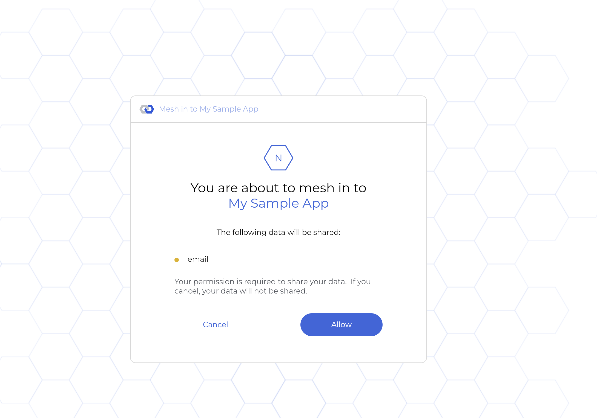

# mesh-sample-oidc-app

## Overview 

This is a sample of a client web application using the mesh as it's Identify Provider (IDP).  It uses OpenID Connect (OIDC) to mesh in and get user information.
The code in this repository uses the AppAuth-JS (https://github.com/openid/AppAuth-JS) SDK but any OIDC SDK can be used or the standard OIDC API endpoints can be called 
directly.   The mesh OIDC endpoints are at https://oidc-api.mesh.in/.well-known/openid-configuration

## Setup 

To setup your OIDC configuration in the mesh for use in this sample app or your own app, follow these steps:

1.  Mesh in at https://app.mesh.in

2. Select Developer Tools from bottom left

3. Select "Register a new app"

4. Select "This is a personal app" and click Continue

5. Enter an App Name and App Description and select Continue

6. Enter a Channel Name and Channel description and select Continue

7. Click Add on the OpenID Connect Agent

8. Enter your setup for OIDC and select Submit
- For redirect URI, put http://localhost:3000/callback for testing locally with this sample app
- When the app is hosted, it would be something like https://sampleoidc.example.com/callback but with your hostname
- Select the checkbox for "Use URL fragment in redirect reply".  This is needed for AppAuthJS since it expects the
OIDC redirect to pass results in URL fragments instead of query parameters.
- Put a scope of email to indicate the at email is being requested during the OIDC flow.

9. Copy the Client ID that is returned in the summary screen.  It is at the bottom.  Here it is 
FZONdTOA-YJ-GfJ1XsW9ovAmi6NhArzH8x9C5BZp2P8

10. Select Finish.

11. Put the client id in the .env.development and .env.production files in this repository for the REACT_APP_CLIENT_ID value
- REACT_APP_REDIRECT_URI can also be changed if you are not using localhost:3000

12. Run npm i

13. Run npm run start

14. Browse to http://localhost:3000

15. Select mesh in button at top

16. Select Allow at consent screen

17. You will see a screen that shows your user information and JWT.

## Notes

- The mesh in button (MeshButton.tsx) follows our brand guidelines but should be changed to put your brand's name after "mesh in to"
- This sample app receives the id token (JWT) and access token.  It then uses the access token to call the mesh user info endpoint in AuthService.ts.
- The JWT is signed with ES384
  - This app does not validate the signature since it is client side
  - For a server side application, you should verify the signature
  - Example code of signature verification for nodejs is in the extra directory in this repository.
- A demo of this app running is at https://sampleoidc.mesh.in/
#
